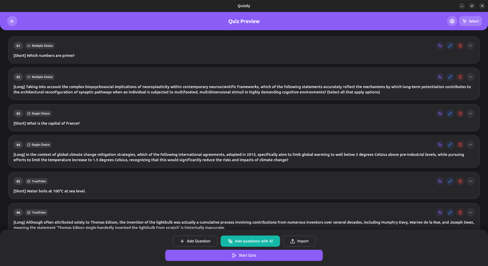

<p align="center">
  
</p>

<p align="center">
  
  
  
  
  
  
  
</p>

**🌟 Official Versions**

Access QuizLab AI on your favorite platform:

- 🌐 **Web**: [vicajilau.github.io/quizlab_ai](https://vicajilau.github.io/quizlab_ai/)
  Enjoy the full experience from any browser.

- 📱 **Android**: [Google Play Store](https://play.google.com/store/apps/details?id=es.victorcarreras.quiz_app)
  Install the app on your Android device and learn anywhere.

- 🪟 **Windows**: [Microsoft Store](https://apps.microsoft.com/store/detail/9P77H0WRJSM2?cid=DevShareMCLPCS)
  Download and install on Windows 10/11 with automatic updates.

- 🐧 **Linux**: [Snapcraft](https://snapcraft.io/quiz-app)
  Download and install easily on any Linux distribution compatible with Snap.

- 📱 **iOS**: [App Store](https://apps.apple.com/app/quiz-appl/id6758663432)
  Available for iPhone and iPad with a native, optimized experience.

- 🍎 **macOS**: [Mac App Store](https://apps.apple.com/app/quiz-appl/id6758663432)
  Native experience optimized for Apple Silicon and Intel Macs.

Interactive quiz experience with AI-powered question generation, customizable questions, real-time scoring, and beautiful animations




_The app provides an intuitive interface for taking quizzes with smooth animations, real-time feedback, and comprehensive score tracking, as shown above._

## Features

### Quiz Mode Features

- **Cross-platform compatibility**: Built with Flutter to run seamlessly on iOS, Android, web, and desktop
- **Multiple question types**: Support for multiple choice, single choice, true/false, and essay questions
- **Real-time scoring**: Instant feedback and score calculation during quiz sessions
- **Beautiful UI/UX**: Modern Material Design with smooth animations and responsive layouts
- **Quiz customization**: Create and customize your own quizzes with flexible question configurations
- **Progress tracking**: Track performance across multiple quiz sessions with detailed analytics
- **Offline support**: Take quizzes without internet connection
- **⏱️ Exam Timer**: Configurable time limits with countdown display and automatic submission when time expires
- **🎲 Question Randomization**: Randomize question order and answer options for varied quiz experiences

### 🤖 AI-Powered Question Generation

- **Multi-AI Service Support**: Integrated support for Google Gemini and OpenAI GPT
- **Intelligent Question Creation**: Generate quiz questions from any text content using AI
- **Flexible Question Types**: AI can create multiple choice, single choice, true/false, essay, or random question types
- **Multi-language Support**: Generate questions in 13 languages including English, Spanish, French, German, Italian, Portuguese, Catalan, Basque, Galician, Hindi, Chinese, Arabic, and Japanese
- **Smart Content Analysis**: AI analyzes your content and creates relevant, educational questions
- **Service-Specific Optimization**: Dynamic limits and validation based on selected AI service
- **Configurable Limits**: Intelligent word and character limits that adapt to each AI service's capabilities
- **🤖 AI Study Assistant**: Interactive AI tutor that can discuss questions, explain concepts, and provide context-aware help during quiz sessions

### 🌍 Internationalization

- **Full Localization**: Complete support for 13 languages including English, Spanish, French, German, Italian, Portuguese, Catalan, Basque, Galician, Hindi, Chinese, Arabic, and Japanese
- **Dynamic Language Switching**: Seamless language changes throughout the app
- **Localized AI Content**: AI-generated questions respect the selected language preference

## App Structure

QuizLab AI follows Clean Architecture principles with clear separation of concerns across multiple layers. The app is designed for maintainability, testability, and extensibility.

### Architecture Overview

- **Presentation Layer**: UI components, screens, dialogs, and state management
- **Domain Layer**: Business logic, use cases, and domain models
- **Data Layer**: Services, repositories, and external API integrations

### Key Components

- **Multi-platform Support**: Flutter-based cross-platform compatibility
- **AI Integration**: Pluggable AI services with dynamic configuration
- **Internationalization**: ARB-based localization system
- **Clean Architecture**: SOLID principles with dependency injection
- **Comprehensive Testing**: Unit, widget, and integration test coverage

For detailed technical documentation including data models, project structure, architectural patterns, and data flow diagrams, see: **[Application Structure Documentation](docs/APP_STRUCTURE.md)**

### 🤖 AI Question Generation

The app features advanced AI integration for automatic question generation:

#### AI Services Configuration

```dart
// Supported AI services with dynamic limits
enum AIServiceType {
  gemini,   // Google Gemini
  openai,   // OpenAI GPT models
}

class AiQuestionGenerationConfig {
  final int? questionCount;
  final AiQuestionType questionType;
  final String language;
  final String content;
  final AIService? preferredService;
}
```

#### AI Question Types

```dart
enum AiQuestionType {
  multipleChoice,  // Multiple choice with several options
  singleChoice,    // Single correct choice
  trueFalse,       // True/false questions
  essay,           // Open-ended essay questions
  random,          // Mix of different types
}
```

For detailed information about AI service limits and configuration, see: **[AI Limits System Documentation](docs/AI_LIMITS_SYSTEM.md)**

## 🚀 Getting Started with AI Features

### Setting Up AI Services

1. **Launch the app** and navigate to the quiz editor
2. **Click the AI generation button** (⚡ icon)
3. **Configure your preferred AI service**:
   - Choose between OpenAI GPT or Google Gemini
   - Enter your API key when prompted
   - The app will validate your configuration

### Generating Questions with AI

1. **Prepare your content**: Write or paste the text you want to generate questions from
2. **Configure generation settings**:
   - **Question Count**: How many questions to generate (1-50)
   - **Question Type**: Multiple choice, single choice, true/false, essay, or random mix
   - **Language**: Select from 13 supported languages
   - **AI Service**: Choose your preferred AI service
3. **Monitor content limits**: The app shows real-time word count and service-specific limits
4. **Generate**: Click generate and the AI will create relevant questions from your content

### AI Service Comparison

| Feature              | OpenAI GPT                   | Google Gemini                |
|----------------------|------------------------------|------------------------------|
| **Word Limit**       | 2,000 words                  | 8,000 words                  |
| **Character Limit**  | 8,000 chars                  | 30,000 chars                 |
| **Generation Style** | Consistent format, reliable  | Large context, creative      |
| **Study Assistant**  | Structured explanations      | Conversational help          |
| **Best For**         | Quick questions & generation | Long content & deep learning |

## ⏱️ Getting Started with Timer & AI Assistant


### Setting Up Exam Timer

1. **Access Settings**: Go to Quiz Settings from the main menu
2. **Enable Timer**: Toggle "Enable time limit" switch
3. **Set Duration**: Enter desired time limit in minutes (1-999)
4. **Start Quiz**: Timer automatically starts when quiz begins
5. **Monitor Progress**: Watch the countdown in the top-right corner during quiz

### Using AI Study Assistant

1. **During Quiz**: Click the "AI" button (🤖) next to any question
2. **Automatic Context**: AI automatically loads:
   - Question text and all answer options
   - Any existing explanations
   - Question type and context
3. **Ask Questions**: Type your question about the topic, concept, or answer choices
4. **Get Explanations**: AI provides detailed, educational responses
5. **Continue Learning**: Ask follow-up questions for deeper understanding

#### AI Assistant Capabilities

- **Concept Explanation**: "Explain the main concept behind this question"
- **Answer Analysis**: "Why is option B correct and C incorrect?"
- **Additional Context**: "Can you provide more examples of this topic?"
- **Study Tips**: "What should I focus on to understand this better?"
- **Related Topics**: "How does this relate to [other concept]?"

## ⏱️ Advanced Quiz Features

### Exam Timer Configuration

- **Flexible Time Limits**: Set custom time limits for exams (1-999 minutes)
- **Visual Countdown**: Real-time countdown timer with color-coded warnings
- **Automatic Submission**: Quiz automatically submits when time expires
- **Timer Control**: Enable/disable timer functionality per quiz session
- **Progress Indication**: Visual progress bar showing remaining time percentage

### 🤖 AI Study Assistant

- **Context-Aware Help**: AI automatically loads question context and options for informed discussions
- **Multi-Service Support**: Choose between OpenAI GPT and Google Gemini for different interaction styles
- **Intelligent Explanations**: Get detailed explanations about question concepts, answer reasoning, and related topics
- **Interactive Chat**: Ask follow-up questions and engage in educational conversations
- **Question Analysis**: AI can explain why answers are correct/incorrect and provide additional learning resources
- **Language Adaptive**: AI responds in the same language as the question content
- **Real-Time Assistance**: Get help while taking quizzes without interrupting your flow

## Requirements

- Flutter SDK 3.41.0 or higher
- Dart SDK 3.11.0 or higher
- Android Studio / Xcode for mobile development
- A device or emulator for testing

### For AI Features (Optional)

- **OpenAI API Key**: For GPT-powered question generation
- **Google AI API Key**: For Gemini-powered question generation
- Internet connection for AI services (quiz taking works offline)

## Installation

1. **Clone this repository**

   ```bash
   git clone https://github.com/vicajilau/quizlab_ai.git
   cd quizlab_ai
   ```

2. **Install dependencies**

   ```bash
   flutter pub get
   ```

3. **Run the app**

   ```bash
   flutter run
   ```

4. **Build for production**

   - **Android**: `flutter build apk --release`
   - **iOS**: `flutter build ios --release`
   - **Web**: `flutter build web --release`

5. **Configure AI Services (Optional)**

   To enable AI question generation, you need to configure API keys:

   - **Gemini**: Get your API key from [Google AI Studio](https://aistudio.google.com/app/apikey)
   - **OpenAI**: Get your API key from [OpenAI Platform](https://platform.openai.com/api-keys)

   The app will guide you through the configuration process when you first try to use AI features.

## Development and Commands

### Main Commands

- `flutter run`: Run the app in development mode
- `flutter run --release`: Run the app in release mode
- `flutter test`: Run unit and widget tests
- `flutter build apk`: Build Android APK
- `flutter build ios`: Build iOS app
- `flutter build web`: Build web version

### Development Workflow

1. **During active development:**

   ```bash
   flutter run --hot-reload
   ```

   This enables hot reload for instant code changes.

2. **To test changes:**

   - Save your changes and see instant updates with hot reload
   - Use `r` to hot reload, `R` to hot restart

3. **Before committing:**

   ```bash
   flutter analyze          # Check for any issues
   flutter test            # Run all tests
   flutter build apk --release  # Verify release build works
   ```

4. **To create a new version:**

   ```bash
   # 1. Update version in pubspec.yaml
   # 2. Run tests to ensure quality
   flutter test

   # 3. Build release versions
   flutter build apk --release
   flutter build ios --release

   # 4. Test on physical devices
   ```

### Testing

The app includes comprehensive testing to ensure quiz functionality and AI integration:

- **Unit tests**: Core business logic, quiz mechanics, and AI service integration
- **Widget tests**: UI components, user interactions, and AI dialog functionality
- **Integration tests**: End-to-end quiz flow testing including AI question generation
- **Performance tests**: App responsiveness, memory usage, and AI service performance
- **AI Service tests**: Validation of AI service limits, content validation, and error handling

```bash
# Run all tests
flutter test

# Run tests with coverage
flutter test --coverage

# Run specific test file
flutter test test/quiz_logic_test.dart

# Run integration tests
flutter test integration_test/
```

### Quiz Logic Validation

The app validates:

- **Quiz structure**:

  - Valid question types and formats
  - Correct answer validation
  - Score calculation accuracy
  - Time tracking functionality

- **User interactions**:

  - Answer selection and submission
  - Navigation between questions
  - Quiz completion flow
  - Result calculation and display

- **AI Integration**:

  - Service availability and API key validation
  - Content length and format validation
  - Dynamic limit enforcement
  - Error handling for AI service failures
  - Multi-language content generation

- **Data persistence**: Progress saving, quiz history, and AI service configuration

### Extensible Architecture

The app is designed to easily support new question types, AI services, and features:

```dart
// Currently supported question types
enum QuestionType {
  multipleChoice,
  singleChoice,
  trueFalse,
  essay,
}

// Currently supported AI services
enum AIServiceType {
  openai,
  gemini,
}

// Future support planned
enum QuestionType {
  multipleChoice,
  singleChoice,
  trueFalse,
  essay,
  fillInBlank,
  matching,
  dragAndDrop,
  ordering,
}

// Future AI services
enum AIServiceType {
  openai,
  gemini,
  claude,
  cohere,
}
```

For detailed technical documentation including complete project structure, data models, and architectural patterns, see: **[Application Structure Documentation](docs/APP_STRUCTURE.md)**

## Contributing

Contributions are welcome! Please follow these steps:

### To Contribute

1. **Fork the repository**
2. **Create a branch for your feature:**

   ```bash
   git checkout -b feature/new-question-type
   ```

3. **Make changes and test:**

   ```bash
   flutter analyze        # Check for any issues
   flutter test          # Verify tests pass
   ```

4. **Test the app:**

   ```bash
   # Test on different platforms
   flutter run -d android
   flutter run -d ios
   flutter run -d chrome
   ```

5. **Commit and push:**

   ```bash
   git add .
   git commit -m "feat: add drag and drop question type support"
   git push origin feature/new-question-type
   ```

6. **Create Pull Request**

### Conventions

- **Commits**: Use [Conventional Commits](https://www.conventionalcommits.org/)

  - `feat:` for new features (e.g., new question types, UI improvements)
  - `fix:` for bug fixes
  - `docs:` for documentation changes
  - `refactor:` for code refactoring
  - `test:` for adding or modifying tests

- **Code**:
  - Follow Flutter/Dart style guidelines
  - Use meaningful variable and function names
  - Add comments for complex logic
  - Ensure responsive design for different screen sizes
  - Update tests when adding new features

### Adding New Question Types

To add a new question type:

1. **Create the question model** (`lib/domain/models/`)
2. **Add question type enum** (`lib/core/constants/`)
3. **Implement UI widgets** (`lib/presentation/widgets/`)
4. **Add business logic** (`lib/domain/use_cases/`)
5. **Update repositories** (`lib/data/repositories/`)
6. **Add AI generation support** if applicable
7. **Add tests** for the new functionality

### Adding New AI Services

To add a new AI service:

1. **Implement AIService interface** (`lib/data/services/ai/`)
2. **Add service limits** in `AILimitsConfig`
3. **Update AIServiceSelector**
4. **Add service-specific configuration**
5. **Add localization strings**
6. **Add comprehensive tests**

For detailed information, see: **[AI Limits System Documentation](docs/AI_LIMITS_SYSTEM.md)**

## 📚 Documentation

### Core Documentation

- **[Main README](README.md)**: This file - comprehensive overview and setup guide
- **[Application Structure](docs/APP_STRUCTURE.md)**: Detailed technical documentation about app architecture, data models, and project structure
- **[AI Limits System](docs/AI_LIMITS_SYSTEM.md)**: Detailed documentation about AI service integration, limits, and configuration

### Key Features Documentation

- **AI Question Generation**: Automatic question creation from text content using multiple AI services
- **AI Study Assistant**: Interactive tutor for explaining concepts and providing context-aware help during quizzes
- **Exam Timer System**: Configurable time limits with visual countdown and automatic submission
- **Multi-language Support**: Full internationalization with 13 language support
- **Dynamic Service Limits**: Intelligent content validation based on selected AI service capabilities
- **Cross-platform Compatibility**: Seamless operation across iOS, Android, web, and desktop platforms
- **Question Randomization**: Flexible ordering and answer shuffling for varied quiz experiences

### Technical Architecture

- **Clean Architecture**: Separation of concerns with data, domain, and presentation layers
- **Dependency Injection**: Service locator pattern for maintainable code
- **State Management**: Provider pattern for reactive UI updates
- **Localization**: ARB-based internationalization system

### Reporting Issues

If you find a bug or have a suggestion:

1. **Check** that a similar issue doesn't already exist
2. **Create a new issue** with:
   - Clear description of the problem
   - Steps to reproduce
   - Screenshots if applicable
   - Device information (OS, Flutter version)
   - Expected vs actual behavior
   - **For AI-related issues**: Include AI service used, content length, and error messages

### Feature Requests

We welcome suggestions for:

- **New AI services** integration (Claude, Cohere, etc.)
- **Additional question types** (fill-in-blank, matching, drag-and-drop)
- **Enhanced AI capabilities** (difficulty adaptation, topic detection, personalized learning paths)
- **Advanced timer features** (pause/resume, time extensions, per-question timing)
- **Expanded AI assistant** (voice interactions, multimedia explanations, study plan generation)
- **New languages** for localization
- **Quiz analytics** and performance tracking

## License

- This project is licensed under the GPL-3.0-or-later License - see the [LICENSE](LICENSE) file for details.
