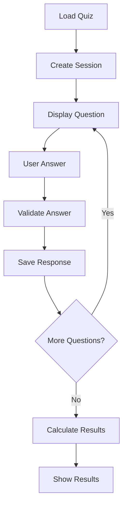
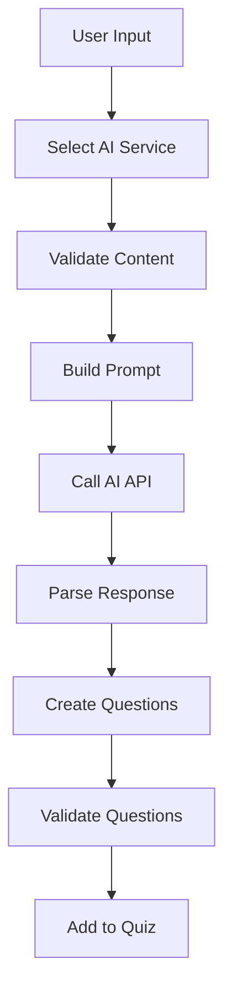
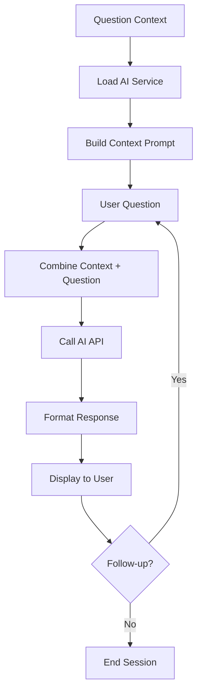

# QuizLab AI - Application Structure

## Overview

This document provides a comprehensive overview of the QuizLab AI's architecture, data models, and project structure. The app follows Clean Architecture principles with clear separation of concerns across multiple layers.

## App Architecture

### Clean Architecture Layers

```
┌─────────────────────────────────────────┐
│              Presentation               │  ← UI, Widgets, Dialogs, Screens
├─────────────────────────────────────────┤
│                Domain                   │  ← Business Logic, Use Cases, Models
├─────────────────────────────────────────┤
│                 Data                    │  ← Services, Repositories, APIs
└─────────────────────────────────────────┘
```

### Core Principles

- **Dependency Inversion**: Inner layers don't depend on outer layers
- **Single Responsibility**: Each class has one reason to change
- **Open/Closed**: Open for extension, closed for modification
- **Interface Segregation**: Small, focused interfaces
- **Dependency Injection**: Using Service Locator pattern

## Data Models

### Quiz Configuration

The app supports flexible quiz configurations through a structured approach:

```dart
class Quiz {
  final String title;
  final String description;
  final List<Question> questions;
  final QuizSettings settings;
  final DateTime? createdAt;
  final DateTime? lastModified;
  final Map<String, dynamic>? metadata;
}

class QuizSettings {
  final bool enableTimer;
  final int? timeLimitMinutes;
  final bool randomizeQuestions;
  final bool randomizeAnswers;
  final bool showCorrectAnswerCount;
  final QuestionOrder questionOrder;
}
```

### Question Types

#### Base Question Structure

```dart
abstract class Question {
  final String id;
  final QuestionType type;
  final String text;
  final int points;
  final String? explanation;
  final String? image;
  final Map<String, dynamic>? metadata;
}
```

#### Multiple Choice Questions

```dart
class MultipleChoiceQuestion extends Question {
  final List<String> options;
  final List<int> correctAnswers;  // Multiple correct answers supported
  final bool shuffleOptions;

  // Validation
  bool get hasMultipleCorrectAnswers => correctAnswers.length > 1;
  bool isCorrectAnswer(List<int> selectedAnswers) =>
      selectedAnswers.toSet().equals(correctAnswers.toSet());
}
```

#### Single Choice Questions

```dart
class SingleChoiceQuestion extends Question {
  final List<String> options;
  final int correctAnswer;  // Single correct answer index
  final bool shuffleOptions;

  // Validation
  bool isCorrectAnswer(int selectedAnswer) => selectedAnswer == correctAnswer;
}
```

#### True/False Questions

```dart
class TrueFalseQuestion extends Question {
  final bool correctAnswer;

  // Validation
  bool isCorrectAnswer(bool selectedAnswer) => selectedAnswer == correctAnswer;
}
```

#### Essay Questions

```dart
class EssayQuestion extends Question {
  final String? sampleAnswer;
  final int? minWords;
  final int? maxWords;
  final List<String>? keywords;  // Keywords to look for in answers

  // Validation (manual or AI-assisted)
  bool validateLength(String answer) {
    final wordCount = answer.trim().split(RegExp(r'\s+')).length;
    return (minWords == null || wordCount >= minWords!) &&
           (maxWords == null || wordCount <= maxWords!);
  }
}
```

### AI Integration Models

#### AI Question Generation

```dart
class AiQuestionGenerationConfig {
  final int? questionCount;
  final AiQuestionType questionType;
  final String language;
  final String content;
  final AIService? preferredService;
  final Map<String, dynamic>? additionalParams;
}

enum AiQuestionType {
  multipleChoice,  // Multiple choice with several options
  singleChoice,    // Single correct choice
  trueFalse,       // True/false questions
  essay,           // Open-ended essay questions
  random,          // Mix of different types
}
```

#### AI Service Architecture

```dart
abstract class AIService {
  // Core functionality
  Future<String> getChatResponse(String prompt, AppLocalizations localizations);
  Future<bool> isAvailable();

  // Service information
  String get serviceName;
  String get defaultModel;

  // Dynamic limits
  AIServiceLimits get limits;
  bool isContentWithinLimits(String content);
  String getLimitsDescription(AppLocalizations localizations);
}

class AIServiceLimits {
  final int maxWords;
  final int? maxCharacters;
  final String description;

  bool isContentValid(String content) {
    final wordCount = content.trim().isEmpty ? 0 : content.split(RegExp(r'\s+')).length;
    if (wordCount > maxWords) return false;

    if (maxCharacters != null && content.length > maxCharacters!) return false;

    return true;
  }
}
```

### Quiz Execution Models

#### Quiz Session

```dart
class QuizSession {
  final String id;
  final Quiz quiz;
  final DateTime startTime;
  final DateTime? endTime;
  final List<QuestionResponse> responses;
  final QuizSessionSettings settings;
  final QuizResult? result;

  // Session state
  bool get isCompleted => endTime != null;
  Duration get elapsedTime =>
      (endTime ?? DateTime.now()).difference(startTime);
  double get progressPercentage =>
      responses.length / quiz.questions.length;
}

class QuestionResponse {
  final String questionId;
  final dynamic answer;  // Can be int, List<int>, bool, or String
  final DateTime timestamp;
  final Duration timeSpent;
  final bool isCorrect;
  final double pointsEarned;
}

class QuizResult {
  final double totalScore;
  final double maxScore;
  final int correctAnswers;
  final int totalQuestions;
  final Duration totalTime;
  final Map<QuestionType, QuestionTypeResult> resultsByType;

  double get percentage => (totalScore / maxScore) * 100;
  String get grade => _calculateGrade(percentage);
}
```

### Internationalization Models

```dart
class LocalizationConfig {
  final Locale currentLocale;
  final List<Locale> supportedLocales;
  final AppLocalizations localizations;

  // Supported languages for AI generation
  static const List<String> aiSupportedLanguages = [
    'es', 'en', 'fr', 'de', 'it', 'pt', 'ca', 'eu', 'gl'
  ];

  String getLanguageName(String languageCode) {
    // Maps language codes to localized names
  }
}
```

## Project Structure

```
quiz_app/
├── .github/                          # GitHub workflows and assets
│   ├── workflows/                    # CI/CD pipelines
│   │   ├── flutter_workflow.yml     # Build and test automation
│   │   └── deploy-web.yml           # Web deployment
│   └── assets/                      # Demo images and branding
│       ├── demo.png                # App screenshots
│       └── QuizLab_AI.png                # App icon
│
├── lib/                             # Main application code
│   ├── main.dart                    # Application entry point
│   │
│   ├── core/                        # Core utilities and shared code
│   │   ├── service_locator.dart     # Dependency injection
│   │   ├── color_manager.dart       # Theme and color management
│   │   ├── constants/               # App-wide constants
│   │   └── l10n/                    # Internationalization
│   │       ├── app_en.arb          # English translations
│   │       ├── app_es.arb          # Spanish translations
│   │       ├── app_localizations.dart
│   │       ├── app_localizations_en.dart
│   │       └── app_localizations_es.dart
│   │
│   ├── data/                        # Data layer
│   │   ├── repositories/            # Data repositories
│   │   │   ├── quiz_repository.dart
│   │   │   └── settings_repository.dart
│   │   └── services/                # External services
│   │       ├── ai/                  # AI service integration
│   │       │   ├── ai_service.dart            # Abstract AI interface
│   │       │   ├── ai_service_selector.dart   # Service selection logic
│   │       │   ├── ai_limits_config.dart      # Service limits configuration
│   │       │   └── gemini_service.dart        # Google Gemini implementation
│   │       ├── openai_service.dart            # OpenAI implementation
│   │       ├── configuration_service.dart     # App configuration
│   │       ├── file_service.dart             # File I/O operations
│   │       └── ai_question_generation_service.dart # AI question generation
│   │
│   ├── domain/                      # Business logic layer
│   │   ├── models/                  # Domain models
│   │   │   ├── quiz/               # Quiz-related models
│   │   │   │   ├── quiz.dart
│   │   │   │   ├── question.dart
│   │   │   │   ├── quiz_result.dart
│   │   │   │   └── quiz_session.dart
│   │   │   ├── ai/                 # AI-related models
│   │   │   │   ├── ai_config.dart
│   │   │   │   └── ai_response.dart
│   │   │   └── settings/           # Settings models
│   │   │       └── app_settings.dart
│   │   └── use_cases/              # Business logic use cases
│   │       ├── quiz_execution/
│   │       ├── ai_generation/
│   │       └── settings_management/
│   │
│   ├── presentation/                # UI layer
│   │   ├── screens/                 # Main application screens
│   │   │   ├── home_screen.dart
│   │   │   ├── file_loaded_screen.dart
│   │   │   ├── quiz_file_execution_screen.dart
│   │   │   └── dialogs/             # Dialog components
│   │   │       ├── ai_generate_questions_dialog.dart
│   │   │       ├── ai_question_dialog.dart
│   │   │       ├── settings_dialog.dart
│   │   │       └── quiz_results_dialog.dart
│   │   ├── widgets/                 # Reusable UI components
│   │   │   ├── question_widgets/    # Question type specific widgets
│   │   │   ├── quiz_widgets/        # Quiz execution widgets
│   │   │   └── common/              # Common UI components
│   │   └── providers/               # State management
│   │       ├── quiz_provider.dart
│   │       ├── settings_provider.dart
│   │       └── ai_provider.dart
│   │
│   └── routes/                      # Navigation management
│       ├── app_router.dart
│       └── route_names.dart
│
├── docs/                            # Documentation
│   ├── AI_LIMITS_SYSTEM.md         # AI service limits documentation
│   └── APP_STRUCTURE.md            # This file - app structure documentation
│
├── test/                            # Unit and widget tests
│   ├── unit/                        # Unit tests
│   │   ├── services/
│   │   ├── models/
│   │   └── use_cases/
│   ├── widget/                      # Widget tests
│   │   ├── screens/
│   │   └── dialogs/
│   └── helpers/                     # Test utilities
│
├── integration_test/                # Integration tests
│   ├── app_test.dart               # End-to-end app tests
│   ├── quiz_flow_test.dart         # Quiz execution flow
│   └── ai_integration_test.dart    # AI features testing
│
├── android/                         # Android-specific code
├── ios/                            # iOS-specific code
├── web/                            # Web-specific code
├── windows/                        # Windows-specific code
├── macos/                          # macOS-specific code
├── linux/                          # Linux-specific code
│
├── images/                         # App assets and images
├── scripts/                        # Development scripts
│
├── pubspec.yaml                    # Dependencies and project configuration
├── analysis_options.yaml          # Code analysis configuration
├── l10n.yaml                       # Localization configuration
└── README.md                       # Main project documentation
```

## Key Architectural Patterns

### 1. Service Locator Pattern

```dart
class ServiceLocator {
  static ServiceLocator? _instance;
  static ServiceLocator get instance => _instance ??= ServiceLocator._();

  final Map<Type, dynamic> _services = {};

  T get<T>() => _services[T] as T;
  void register<T>(T service) => _services[T] = service;
}
```

### 2. Repository Pattern

```dart
abstract class QuizRepository {
  Future<Quiz> loadQuiz(String path);
  Future<void> saveQuiz(Quiz quiz, String path);
  Future<List<Quiz>> getRecentQuizzes();
}

class FileQuizRepository implements QuizRepository {
  // Implementation for file-based quiz storage
}
```

### 3. Provider Pattern (State Management)

```dart
class QuizProvider extends ChangeNotifier {
  Quiz? _currentQuiz;
  QuizSession? _currentSession;

  void startQuiz(Quiz quiz) {
    _currentQuiz = quiz;
    _currentSession = QuizSession.create(quiz);
    notifyListeners();
  }
}
```

### 4. Factory Pattern (Question Creation)

```dart
class QuestionFactory {
  static Question createQuestion(Map<String, dynamic> json) {
    switch (json['type']) {
      case 'multipleChoice':
        return MultipleChoiceQuestion.fromJson(json);
      case 'singleChoice':
        return SingleChoiceQuestion.fromJson(json);
      case 'trueFalse':
        return TrueFalseQuestion.fromJson(json);
      case 'essay':
        return EssayQuestion.fromJson(json);
      default:
        throw UnsupportedError('Question type not supported');
    }
  }
}
```

## Data Flow

### Quiz Execution Flow



### AI Question Generation Flow



### AI Study Assistant Flow



## Performance Considerations

### Memory Management

- Efficient question loading for large quiz files
- Image caching and lazy loading
- Proper disposal of resources and listeners

### AI Service Optimization

- Request caching to avoid duplicate API calls
- Intelligent retry mechanisms with exponential backoff
- Content validation before API calls to prevent errors

### UI Performance

- Virtual scrolling for large question lists
- Smooth animations with proper timing
- Responsive design for different screen sizes

## Security Considerations

### API Key Management

- Secure storage of API keys using platform-specific secure storage
- No hardcoded keys in source code
- Validation of API keys before use

### Data Privacy

- Local storage of quiz data and results
- No personal data sent to AI services without consent
- Clear privacy policies for AI features

## Testing Strategy

### Unit Tests

- Business logic validation
- Model serialization/deserialization
- Service functionality

### Widget Tests

- UI component behavior
- User interaction flows
- State management

### Integration Tests

- End-to-end quiz flows
- AI service integration
- File operations

For more detailed information about specific components, see the related documentation files in the `docs/` folder.
